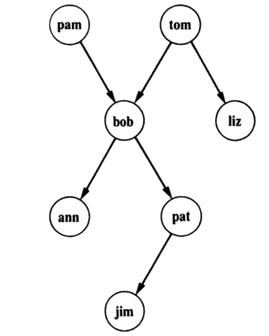
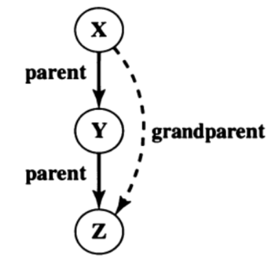
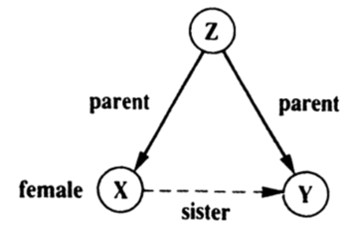

## Defining Relations using Facts and Rules


Prolog represents knowledge using facts and rules. Facts are simple declarative statements about objects and their properties, while rules express logical relationships between facts. This declarative approach allows for concise and intuitive knowledge representation. Prolog's inference engine can then reason over these facts and rules to derive new knowledge, making it a powerful tool for solving problems that involve logical reasoning.


---
### 1- Defining Relations using Facts:

**Facts are like predicate expression and they are unconditionaly true**

create a file `family.pl` with the following facts
```prolog
parent(pam, bob).
parent(tom, bob).
parent(tom, liz).
parent(bob, ann).
parent(bob, pat).
parent(pat, jim).
```
consult the file



---

### 2- Can be used to ask questions:
| <div style="width:40vw">Query</div> | answer | details |
| - | - | - |
| `?-parent(bob, pat).` | `true.` | is bob parent of pat |
| `?-parent(liz, pat).` | `false.` | is liz parent of pat |
| `?-parent(X, liz).` | `X = tom` | who is the parent of liz |
| `?-parent(bob, X).` | `X = ann;` <br> `X = pat.` | who are the childs of bob |
| `?-parent(X, Y).` | `X = bob;` <br> `Y = ann;` <br> `...` | who are the parents of who |
| `?-parent(X, jim), parent(Y, X).` | `X = bob` <br> `Y = pat;` <br> `...` | who is the father and grandfather of jim |
| `?-parent(tom, X), parent(X, Y).` | `X = bob,` <br> `Y = ann;` <br> `X = bob,` <br> `Y = pat;` <br> `false.` | who are the childs and grandchilds of tom |

---

### 3- Defining Relations using Rules

Where facts are unconditionaly true, rules specify things that are true if some condition is satisfied. Rules works on the basis of facts we define.

Create a file `family2.pl` with the following facts and rules

```prolog
parent(pam, bob).
parent(tom, bob).
parent(tom, liz).
parent(bob, ann).
parent(bob, pat).
parent(pat, jim).
male(tom).
male(bob).
male(jim).
female(pam).
female(liz).
female(pat).
female(ann).
mother(X, Y) :-
    parent(X, Y),
    female(X).
```

Alternative binary `gender(pam, feminine).` and `gender(tom, masculine).`

Now we may query the mother of <u>bob</u> `?-mother(X, bob).`

---
### 4- Granparent rule
```prolog
grandparent(X, Z) :- 
    parent(X, Y), 
    parent(Y, Z).
```



### 5- Sister rule
---
```prolog
sister(X, Y) :- 
    parent(Z, X), 
    parent(Z, Y), 
    female(X).
```


you may notice that the query `?-sister(X, pat).` results in the following
```
X = ann;
X = pat.
```

<u>pat</u> is the sister of herself ???

```prolog
sister(X, Y) :-
    parent(Z, X), 
    parent(Z, Y), 
    female(X), 
    X \= Y
```

---
> For more questions email: nagy@aast.edu
