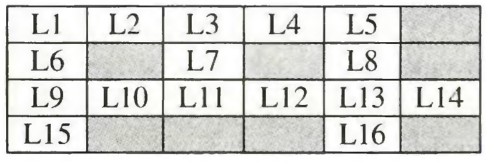

## Solving Problems with Prolog


Prolog's declarative nature and pattern matching capabilities make it well-suited for solving games and puzzles. By representing game states as logical facts and defining rules for generating possible moves, Prolog can efficiently explore the solution space. This approach allows for elegant and concise solutions to a wide range of games, from simple puzzles to complex strategic games like chess and checkers.


---
### 1- Solving Crosswords:

The vocabulary is given by the predicates word with 3 to 6 arguments.
create a file `crosswords.pl` with the following facts
```prolog
word(d, o, g).
word(f, o, u, r).
word(b, a, k, e, r).
word(p, r, o, l, o, g).
word(r, u, n).
word(l, o, s, t).
word(f, o, r, u, m).
word(v, a, n, i, s, h).
word(t, o, p).
word(m, e, s, s).
word(g, r, e, e, n).
word(w, o, n, d, e, r).
word(f, i, v, e).
word(u, n, i, t).
word(s, u, p, e, r).
word(y, e, l, l, o, w).
```



The cells Li are to be filled with letters so that the horizontally or vertically adjacent letters form legal words from given vocabulary.

```prolog
solution(L1, L2, L3, L4, L5, L6, L7, L8, L9, L10, L11, L12, L13, L14, L15, L16) :-
    word(L1, L2, L3, L4, L5),
    word(L1, L6, L9, L15),
    word(L9, L10, L11, L12, L13, L14),
    word(L3, L7, L11),
    word(L5, L8, L13, L16).
```

The solution 
```
F	O	R	U	M	-
I	-	U	-	E	-
V	A	N	I	S	H
E	-	-	-	S	-
```
---

### 2- Solving 8 Queens Problem:


Create a file `medical.pl` with the following facts and rules
```
symptom(fever, flu).
symptom(cough, flu).
symptom(headache, flu).
symptom(muscle_ache, flu).

symptom(rash, measles).
symptom(fever, measles).
symptom(cough, measles).
```

we may ask the system questions, for example:
- what are the symptoms of flu `?-symptom(X, flu).`
- what is the possible diseases for fever `?-symptom(fever, X).`
- what is the possible diseases for fever and rash `?-symptom(fever, X), symptom(rash, X).`

---
> For more questions email: nagy@aast.edu
